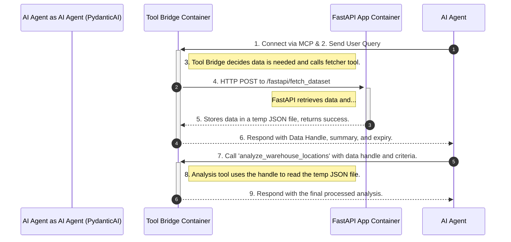
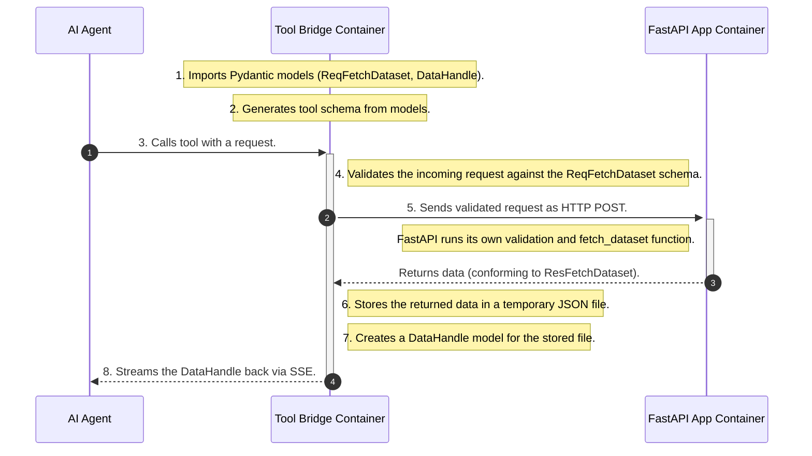
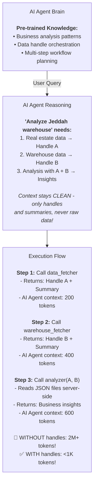
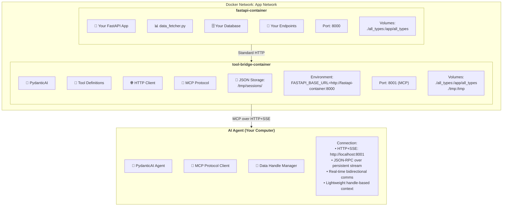

# Model Context Protocol (MCP) Guide for Location Intelligence Platform
# Table of Contents

## Overview
- [Modified MCP Guide: Data Handles Architecture for Location Intelligence Platform](#modified-mcp-guide-data-handles-architecture-for-location-intelligence-platform)

## Core Architecture
- [1. Updated Overall Architecture - Data Handles Flow](#1-updated-overall-architecture---data-handles-flow)
- [2. Updated Data Validation Flow with Temporary JSON Storage](#2-updated-data-validation-flow-with-temporary-json-storage)
- [3. Updated Timeline: When Things Happen with Data Handles](#3-updated-timeline-when-things-happen-with-data-handles)
  - [Build Time](#build-time)
  - [Conversation Start (Runtime)](#conversation-start-runtime)
  - [During Conversation (Runtime) - Data Handles Flow](#during-conversation-runtime---data-handles-flow)
  - [Conversation End](#conversation-end)
- [4. Updated Tool Discovery & Decision Flow with Handles](#4-updated-tool-discovery--decision-flow-with-handles)

## Implementation Details
- [5. Updated Tool Examples with Data Handles](#5-updated-tool-examples-with-data-handles)
  - [Data Fetching Tool (Returns Handle)](#data-fetching-tool-returns-handle)
  - [Analysis Tool (Accepts Handles)](#analysis-tool-accepts-handles)
- [6. Docker Container Communication Architecture with Data Handles](#6-docker-container-communication-architecture-with-data-handles)
  - [Communication Flow with Data Handles](#communication-flow-with-data-handles)
  - [Key Communication Patterns with Data Handles](#key-communication-patterns-with-data-handles)
    - [Runtime Discovery (Every Conversation)](#runtime-discovery-every-conversation)
    - [Autonomous Decision Making with Handles](#autonomous-decision-making-with-handles)
    - [Type-Safe Data Flow with Handle Validation](#type-safe-data-flow-with-handle-validation)
    - [Container Isolation with Shared Storage](#container-isolation-with-shared-storage)
    - [Real-time Communication with Lightweight Payloads](#real-time-communication-with-lightweight-payloads)
  - [Key Benefits of Using Your Existing Pydantic Models with Data Handles](#key-benefits-of-using-your-existing-pydantic-models-with-data-handles)
    - [Type Safety Throughout with Handle Management](#type-safety-throughout-with-handle-management)
    - [Zero Code Duplication with Enhanced Efficiency](#zero-code-duplication-with-enhanced-efficiency)
  - [How AI Agent Learns Your Saudi Arabia Tools with Data Handles](#how-ai-agent-learns-your-saudi-arabia-tools-with-data-handles)
    - [Descriptive Tool Definitions with Handle Context](#descriptive-tool-definitions-with-handle-context)
    - [Strategic Keywords in Descriptions with Handle Workflow Guidance](#strategic-keywords-in-descriptions-with-handle-workflow-guidance)
    - [Analysis Tool Descriptions for Handle Processing](#analysis-tool-descriptions-for-handle-processing)

## Performance & Benefits
- [7. Key Benefits of Data Handles Architecture](#7-key-benefits-of-data-handles-architecture)
  - [Context Efficiency Comparison](#context-efficiency-comparison)
  - [Updated Workflow Benefits](#updated-workflow-benefits)
- [8. Updated Session Management](#8-updated-session-management)

## Complete Tool System
- [9. Complete Tool Architecture](#9-complete-tool-architecture)
  - [The Single Data Fetcher Tool](#the-single-data-fetcher-tool)
  - [Additional Analysis Tools for Report Generation](#additional-analysis-tools-for-report-generation)
    - [Tool 2: Market Intelligence Analyzer](#tool-2-market-intelligence-analyzer)
    - [Tool 3: Site Selection Optimizer](#tool-3-site-selection-optimizer)
    - [Tool 4: Route & Coverage Calculator](#tool-4-route--coverage-calculator)
    - [Tool 5: Financial Viability Assessor](#tool-5-financial-viability-assessor)
    - [Tool 6: Risk Assessment Engine](#tool-6-risk-assessment-engine)
    - [Tool 7: Implementation Roadmap Generator](#tool-7-implementation-roadmap-generator)
  - [Complete Tool Orchestration Flow](#complete-tool-orchestration-flow)
  - [Tool Specialization Summary](#tool-specialization-summary)
  - [Updated Tool Discovery for AI Agent](#updated-tool-discovery-for-ai-agent)

---
## What is MCP and Why Should You Care?

The Model Context Protocol (MCP) is a revolutionary way to connect AI models to external tools and services. Instead of manually coding every AI interaction, MCP allows AI models to **autonomously discover and orchestrate tools** to solve complex business location problems.

## The Revolution: Before vs After MCPs

### ❌ Without MCP (Traditional Approach)

```python
# You manually code every step of AI interaction
async def analyze_riyadh_for_logistics_hub():
    # Step 1: You manually fetch POI data
    poi_data = await fetch_dataset({
        "country_name": "Saudi Arabia",
        "city_name": "Riyadh", 
        "boolean_query": "warehouse OR logistics OR distribution_center",
        "action": "full data"
    })
    
    # Step 2: You manually call distance calculations  
    distances = await load_distance_drive_time_polygon({
        "source": {"lat": 24.7136, "lng": 46.6753},
        "destination": {"lat": 24.7500, "lng": 46.7000}
    })
    
    # Step 3: You manually format for AI
    prompt = f"Here's Riyadh logistics data: {poi_data}..."
    
    # Step 4: You manually interpret AI response
    ai_response = await openai.chat.completions.create(
        messages=[{"role": "user", "content": prompt}]
    )
    
    # Step 5: You manually parse and act on response
    if "need demographic data" in ai_response:
        demo_data = await fetch_intelligence_by_viewport(riyadh_viewport)
        # Repeat the whole process...
    
    # Result: 500+ lines of orchestration code for complex workflows

```

### ✅ With MCP (AI Takes Control)

```python
# AI Agent automatically decides what tools to use!
from pydantic_ai import Agent
from pydantic_ai.mcp import MCPServerHTTP

# Setup Tool Bridge connection
tool_bridge = MCPServerHTTP(url='http://localhost:8001/sse')
ai_agent = Agent('claude-3-5-sonnet', mcp_servers=[tool_bridge])

# This single line can produce comprehensive analysis
result = await ai_agent.run(
    "Analyze Dammam, Saudi Arabia for opening a new distribution center. "
    "Consider logistics access, competitor locations, demographics, and traffic patterns."
)

# The AI Agent automatically:
# 1. Discovers available tools from your Tool Bridge
# 2. Decides it needs POI data → calls saudi_location_intelligence_fetcher
# 3. Realizes it needs route analysis → calls geospatial_route_calculator 
# 4. Determines it needs demographics → calls population_viewport_analyzer
# 5. Synthesizes all data into actionable business insights
# 6. Presents a complete analysis WITHOUT you coding the orchestration!

```

## How MCP Works: The Complete Flow

### 1. 🚀 Conversation Initialization

```python
User Text Input
      ↓
🤖 AI Agent (Single LLM)
   - Understands user intent
   - Calls MCP Server to get available tools
      ↓
📋 MCP Server (Tool Bridge Container)
   - Returns tool definitions/schemas
   - NO LLM here - just a registry/router
      ↓
🤖 AI Agent (Same LLM)
   - Selects appropriate tool
   - Calls the tool with parameters
      ↓
🔧 Tool Implementation (Tool Bridge Container)
   - Tool = Smart wrapper around endpoints
   - Logic determines which endpoints to call
   - NO LLM needed - just code logic
      ↓
🌐 FastAPI Endpoints
   - /fetch_dataset
   - /process_llm_query  
      ↓
📊 Results back to AI Agent
```

### 2. 🧠 Runtime Tool Discovery
Every conversation, the AI Agent discovers tools fresh:

```python
# This happens at RUNTIME, not build time
async with ai_agent.run_mcp_servers() as session:
    # 🔄 RIGHT HERE - AI Agent calls Tool Bridge's list_tools()
    available_tools = await tool_bridge.list_tools()
    
    # AI Agent reads ALL tool descriptions fresh each time
    for tool in available_tools:
        ai_context.add_tool(
            name=tool.name,
            description=tool.description,  # ← Read at runtime!
            schema=tool.inputSchema        # ← Read at runtime!
        )
    
    # Now AI Agent has tool knowledge for this conversation
    result = await ai_agent.run("Find gas stations in Jeddah")

```

### 3. 🎯 AI Decision Making Process

```
User: "Find the best location for a logistics hub in Riyadh"

🤖 AI Agent's Internal Reasoning:
1. Parse Intent: "logistics hub" + "Riyadh" + "location analysis" 
2. Check Available Tools: Scan tool descriptions for relevant capabilities
   ├── "saudi_location_intelligence_fetcher" mentions "site selection" ✅
   ├── "geospatial_route_calculator" mentions "logistics planning" ✅  
   └── "population_accessibility_scorer" mentions "location rating" ✅
3. Plan Execution: Follow learned business analysis patterns
4. Execute Tools: Call tools in intelligent sequence
5. Synthesize Results: Combine all data into actionable insights

```

### 4. 🔄 Memory and Persistence

| **What** | **When** | **Where** | **Persistence** |
|----------|----------|-----------|-----------------|
| Tool Descriptions | Runtime (every conversation) | Tool Bridge Response | None - Fresh each time |
| Tool Schemas | Runtime (every conversation) | Tool Bridge Response | None - Fresh each time |
| Reasoning Patterns | Pre-trained (model weights) | AI Agent | Permanent |
| Conversation Memory | Runtime (during conversation) | AI Agent Context | Deleted after conversation |
| Tool Results | Runtime (during conversation) | AI Agent Context | Deleted after conversation |

## Dedicated Container Architecture with Shared Pydantic Models

For our implementation, we use **separate containers** with shared Pydantic models between all services:

```python
project/
├── fastapi-app/               # Your existing FastAPI backend
│   └──all_types/
│       ├── __init__.py
│       ├── request_dtypes.py      # ReqFetchDataset, ReqPrdcerLyrMapData, etc.
│       ├── response_dtypes.py     # ResFetchDataset, ResLyrMapData, etc.
│       └── internal_types.py      # UserId, LayerInfo, UserCatalogInfo, etc.
│   └──tool_bridge_mcp_server/               # Tool Bridge (separate container)
│       ├── Dockerfile
│       ├── requirements.txt
│       ├── main.py               # Tool Bridge server
│       └── tools/
│           ├── __init__.py
│           ├── xyz1.py
│           ├── xyz1.py
│           └── xyz1.py
│   ├── Dockerfile
│   ├── requirements.txt
│   ├── fastapi_app.py        # Your main FastAPI file
│   ├── data_fetcher.py       # Your existing data fetcher
│   └── ... (existing FastAPI code)
└── docker-compose.yml

```
I'll fix the header levels to create a logical hierarchy throughout the guide. Here's the corrected version:Here's the corrected version with properly organized header levels:

# Modified MCP Guide: Data Handles Architecture for Location Intelligence Platform

Here are the key sections of your guide that need modification to implement the **Data Handles/References architecture**:

## 1. Updated Overall Architecture - Data Handles Flow



## 2. Updated Data Validation Flow with Temporary JSON Storage



Key Changes:
✅ Tools store large datasets in temporary JSON files
✅ AI Agent only receives lightweight handles + summaries  
✅ Analysis tools read data from JSON files using handles
✅ Zero context pollution - AI Agent context stays clean
✅ Session-based cleanup - temp files auto-deleted

## 3. Updated Timeline: When Things Happen with Data Handles

### Build Time
```Python
📅 BUILD TIME
├── Three separate Docker containers built
├── all_types/ includes new DataHandle and SessionInfo models
├── Tool Bridge has /tmp/sessions/ directory for JSON storage
├── Your existing Pydantic models work unchanged
└── No AI Agent-Tool Bridge connection yet
```

### Conversation Start (Runtime)
```Python
🚀 CONVERSATION START (Runtime)
├── 1. User creates PydanticAI AI Agent with Tool Bridge servers
├── 2. ai_agent.run_mcp_servers() called
├── 3. AI Agent connects to Tool Bridge via HTTP+SSE (port 8001)
├── 4. Tool Bridge creates unique session: /tmp/sessions/abc123/
├── 5. AI Agent calls bridge.list_tools() via MCP protocol
├── 6. Tool Bridge returns tool definitions (FRESH each time)
├── 7. AI Agent loads tool descriptions into conversation context
└── 8. Ready to process user requests
```

### During Conversation (Runtime) - Data Handles Flow
```Python
💭 DURING CONVERSATION (Runtime) - DATA HANDLES FLOW
├── 9. User asks: "Analyze Jeddah for warehouse location"
├── 10. AI Agent calls: saudi_location_intelligence_fetcher
├── 11. Tool Bridge calls FastAPI, gets full dataset
├── 12. Tool Bridge STORES data in JSON: /tmp/sessions/abc123/real_estate_jeddah.json
├── 13. Tool Bridge returns HANDLE to AI Agent:
│    {
│      "data_handle": "real_estate_jeddah_20241206_abc123",
│      "summary": {"count": 50000, "avg_price": 2500},
│      "schema": {"lat": "float", "lng": "float", "price": "int"},
│      "file_path": "/tmp/sessions/abc123/real_estate_jeddah.json"
│    }
├── 14. AI Agent decides: need warehouse data too
├── 15. AI Agent calls: warehouse_rental_fetcher  
├── 16. Tool Bridge stores warehouse data, returns another handle
├── 17. AI Agent calls: analyze_warehouse_locations with BOTH handles:
│    {
│      "real_estate_handle": "real_estate_jeddah_20241206_abc123",
│      "warehouse_handle": "warehouse_jeddah_20241206_def456", 
│      "criteria": {"max_distance_to_port": 50}
│    }
├── 18. Analysis tool reads BOTH JSON files using handles
├── 19. Analysis tool processes data server-side, returns insights
├── 20. AI Agent synthesizes final answer (NO raw data in context!)
└── 21. Process repeats with existing handles for follow-up questions
```

### Conversation End
```Python
💀 CONVERSATION END
├── Session cleanup: rm -rf /tmp/sessions/abc123/
├── All handles expire and become invalid
├── AI Agent context cleared (was already lightweight!)
└── Next conversation gets fresh session ID
```

## 4. Updated Tool Discovery & Decision Flow with Handles



## 5. Updated Tool Examples with Data Handles

### Data Fetching Tool (Returns Handle)

```python
class SaudiLocationIntelligenceTool:
    def get_tool_definition(self) -> Tool:
        return Tool(
            name="saudi_location_intelligence_fetcher",
            description="""
            Fetch comprehensive Saudi Arabia location data and return a lightweight handle.
            
            🎯 Returns: DataHandle (NOT raw data) + summary statistics
            💾 Storage: Temporarily stores full dataset in server-side JSON
            ⚡ Performance: Keeps AI Agent context clean and fast
            
            Use for: POI data, real estate, demographics in Saudi cities
            """,
            inputSchema=ReqFetchDataset.model_json_schema()
        )
    
    async def execute(self, arguments: dict) -> list[TextContent]:
        # Validate input
        validated_request = ReqFetchDataset.model_validate(arguments)
        
        # Call your existing FastAPI endpoint  
        response = await self.fetch_from_fastapi(validated_request)
        full_dataset = response.json()["data"]
        
        # 🔑 KEY CHANGE: Store data in JSON file, return handle
        handle = await self.store_data_and_create_handle(
            data=full_dataset,
            data_type="real_estate",
            location="jeddah",
            session_id=self.session_id
        )
        
        return [TextContent(
            type="text", 
            text=f"Stored {len(full_dataset)} records. Handle: {handle.data_handle}"
        )]
```

### Analysis Tool (Accepts Handles)

```python
class WarehouseLocationAnalyzer:
    def get_tool_definition(self) -> Tool:
        return Tool(
            name="analyze_warehouse_locations", 
            description="""
            Analyze warehouse location opportunities using data handles.
            
            🎯 Input: Data handles from previous tool calls
            📊 Process: Reads stored JSON data server-side  
            🚀 Output: Business insights and recommendations
            
            Handles real estate, warehouse, demographic data for analysis.
            """,
            inputSchema={
                "type": "object",
                "properties": {
                    "real_estate_handle": {"type": "string"},
                    "warehouse_handle": {"type": "string"}, 
                    "criteria": {"type": "object"}
                }
            }
        )
    
    async def execute(self, arguments: dict) -> list[TextContent]:
        # Extract handles from input
        real_estate_handle = arguments["real_estate_handle"]
        warehouse_handle = arguments["warehouse_handle"]
        
        # 🔑 KEY CHANGE: Read data from JSON files using handles
        real_estate_data = await self.read_data_from_handle(real_estate_handle)
        warehouse_data = await self.read_data_from_handle(warehouse_handle)
        
        # Perform analysis with full datasets (server-side)
        analysis_results = await self.analyze_locations(
            real_estate_data, 
            warehouse_data, 
            arguments["criteria"]
        )
        
        # Return insights, not raw data
        return [TextContent(
            type="text",
            text=self.format_business_insights(analysis_results)
        )]
```

## 6. Docker Container Communication Architecture with Data Handles



### Communication Flow with Data Handles
1. AI Agent ──MCP Protocol (HTTP+SSE)──► Tool Bridge Container (port 8001)
2. Tool Bridge ──Standard HTTP──► FastAPI Container (port 8000)
3. Tool Bridge ──Store Data──► /tmp/sessions/abc123/data.json
4. Tool Bridge ──Return Handle──► AI Agent (lightweight context)
5. AI Agent ──Handle-based Analysis──► Tool Bridge reads JSON files
6. Both containers share your existing Pydantic models via ./all_types volume
7. Docker internal DNS: fastapi-container:8000, tool-bridge-container:8001
8. AI Agent uses port mapping: localhost:8001 → tool-bridge-container:8001

### Key Communication Patterns with Data Handles

#### Runtime Discovery (Every Conversation)
- AI Agent connects fresh → Tool Bridge returns current tools → AI Agent learns capabilities
- **NEW**: Session creation and cleanup for temporary JSON storage

#### Autonomous Decision Making with Handles  
- AI Agent reads tool descriptions → Matches to user intent → Orchestrates workflow
- **NEW**: AI Agent manages data handles instead of raw data in context

#### Type-Safe Data Flow with Handle Validation
- Your existing Pydantic models → Validation at every step → Consistent schemas
- **NEW**: DataHandle and SessionInfo models for handle management

#### Container Isolation with Shared Storage
- Separate services → Independent scaling → Fault isolation → Shared data models
- **NEW**: Temporary JSON storage for session-based data persistence

#### Real-time Communication with Lightweight Payloads
- MCP Protocol with HTTP+SSE → Persistent connection → Instant updates → Efficient resource usage
- **NEW**: Handle-based responses keep communication lightweight

### Key Benefits of Using Your Existing Pydantic Models with Data Handles

#### Type Safety Throughout with Handle Management

```python
# tool-bridge/tools/saudi_data_fetcher.py
from all_types.request_dtypes import ReqFetchDataset
from all_types.response_dtypes import ResFetchDataset
from all_types.data_handles import DataHandle, SessionInfo

class SaudiLocationIntelligenceTool:
    def get_tool_definition(self) -> Tool:
        return Tool(
            name="saudi_location_intelligence_fetcher",
            description="Fetch POI, real estate, and demographic data for Saudi Arabia locations - returns lightweight handle",
            # ✅ Uses your existing Pydantic schema automatically!
            inputSchema=ReqFetchDataset.model_json_schema()
        )
    
    async def execute(self, arguments: dict) -> list[TextContent]:
        # ✅ Validate input using your existing Pydantic model
        validated_request = ReqFetchDataset.model_validate(arguments)
        
        # Call your existing FastAPI endpoint with validated data
        response = await self.http_client.post(
            f"{self.fastapi_url}/fastapi/fetch_dataset",
            json={
                "message": "Fetching Saudi location data via MCP",
                "request_info": {},
                "request_body": validated_request.model_dump()
            }
        )
        
        # ✅ Validate response using your existing Pydantic model
        validated_response = ResFetchDataset.model_validate(response.json()["data"])
        
        # 🔑 NEW: Store data and create handle instead of returning raw data
        data_handle = await self.store_data_and_create_handle(
            data=validated_response,
            data_type="real_estate",
            location="saudi_arabia",
            session_id=self.session_id
        )
        
        # ✅ Return handle instead of massive dataset
        return [TextContent(
            type="text", 
            text=f"Saudi location data fetched and stored. Handle: {data_handle.data_handle}. "
                 f"Summary: {data_handle.summary['count']} records covering {data_handle.summary['districts']} districts."
        )]
```

#### Zero Code Duplication with Enhanced Efficiency
- **Use your existing models** - ReqFetchDataset, ResPrdcerLyrMapData, etc.
- **Automatic schema generation** for MCP tools from your models
- **Your existing validation** works across all layers
- **Synchronized changes** - update once, works everywhere
- **NEW**: Handle-based architecture eliminates context bloat while preserving data integrity

### How AI Agent Learns Your Saudi Arabia Tools with Data Handles

The AI Agent discovers and understands your tools through **rich descriptions and schemas**, now optimized for handle-based workflows:

#### Descriptive Tool Definitions with Handle Context

```python
def get_tool_definition(self) -> Tool:
    return Tool(
        name="saudi_location_intelligence_fetcher",
        
        # 🧠 AI Agent reads this to understand WHEN to use the tool
        description="""
        Fetch comprehensive location data for Saudi Arabia including Points of Interest (POI), 
        real estate properties, demographic information, and traffic patterns.
        
        🎯 Use this tool when you need to:
        - Analyze business competition in Saudi cities (Riyadh, Jeddah, Dammam)
        - Find nearby amenities like gas stations, restaurants, mosques
        - Gather market research data for site selection in KSA
        - Understand local business landscape in Saudi regions
        - Research foot traffic and accessibility in Saudi locations
        
        ⚡ PERFORMANCE NOTE: This tool returns a lightweight data handle instead of raw data,
        keeping your context clean and fast while preserving full dataset access for analysis tools.
        
        🔗 OUTPUT: Returns DataHandle object with summary statistics and data reference.
        Use the returned handle with analysis tools for processing.
        
        This tool is essential for Saudi Arabia location analysis, market research, 
        competitive intelligence, and business planning tasks. Supports Arabic and English queries.
        """,
        
        # 🎯 AI Agent reads the schema to understand HOW to use the tool
        inputSchema=ReqFetchDataset.model_json_schema()
    )
```

#### Strategic Keywords in Descriptions with Handle Workflow Guidance
Include trigger words that guide AI Agent decision-making for handle-based workflows:

```python
description="""
🎯 TRIGGER WORDS that make AI Agent choose this tool:
- "Saudi Arabia" or "KSA" → AI Agent knows to use for Saudi locations
- "Riyadh" or "Jeddah" or "Dammam" → AI Agent knows to use for specific cities
- "gas stations" or "restaurants" → AI Agent knows to use for POI searches
- "logistics hub" or "warehouse" → AI Agent knows to use for business analysis
- "site selection" → AI Agent knows to use for location analysis

📋 CONTEXT CLUES that guide AI Agent:
- "Use when analyzing Saudi Arabian markets"
- "Essential for KSA business planning and strategy"  
- "Provides insights for Middle East investment decisions"

🔗 HANDLE WORKFLOW GUIDANCE:
- "Returns data handle for efficient context management"
- "Use returned handle with analysis tools for processing"
- "Stores full dataset server-side while keeping AI context lightweight"
- "Handle expires at end of conversation - call early in workflow"
"""
```

#### Analysis Tool Descriptions for Handle Processing

```python
def get_analysis_tool_definition(self) -> Tool:
    return Tool(
        name="analyze_warehouse_locations",
        
        description="""
        Analyze warehouse location opportunities using data handles from previous tool calls.
        
        🎯 INPUT REQUIREMENTS:
        - real_estate_handle: Handle from saudi_location_intelligence_fetcher
        - warehouse_handle: Handle from warehouse_rental_fetcher (optional)
        - criteria: Analysis parameters (distance, size, price range)
        
        📊 PROCESSING:
        - Reads full datasets from handles server-side
        - Performs complex geospatial and business analysis
        - Considers Saudi market conditions and regulations
        - Provides actionable location recommendations
        
        🚀 OUTPUT:
        - Ranked location recommendations with business rationale
        - Market analysis and competitive landscape insights
        - Risk assessment and ROI projections for Saudi market
        
        ⚡ PERFORMANCE: Processes large datasets server-side without bloating AI context.
        """,
        
        inputSchema={
            "type": "object",
            "properties": {
                "real_estate_handle": {
                    "type": "string",
                    "description": "Data handle from saudi_location_intelligence_fetcher"
                },
                "warehouse_handle": {
                    "type": "string", 
                    "description": "Data handle from warehouse_rental_fetcher (optional)"
                },
                "criteria": {
                    "type": "object",
                    "description": "Analysis criteria and business requirements"
                }
            },
            "required": ["real_estate_handle", "criteria"]
        }
    )
```

## 7. Key Benefits of Data Handles Architecture

### Context Efficiency Comparison

```python
# ❌ WITHOUT Data Handles (Your Current Flow)
AI Agent Context:
├── Tool schemas: 2,000 tokens
├── Real estate data: 800,000 tokens (1M records)  
├── Warehouse data: 300,000 tokens (100K records)
├── Analysis results: 5,000 tokens
└── TOTAL: 1,107,000 tokens 💸💸💸

# ✅ WITH Data Handles (Proposed Architecture)  
AI Agent Context:
├── Tool schemas: 2,000 tokens
├── Real estate handle + summary: 100 tokens
├── Warehouse handle + summary: 100 tokens  
├── Analysis results: 5,000 tokens
└── TOTAL: 7,200 tokens ⚡✅

# 🚀 Result: 99.4% reduction in context usage!
```

### Updated Workflow Benefits

```python
# User Request: "Compare 5 Saudi cities for logistics hub"

# Without Handles: AI Agent context explodes
cities_data = 5_000_000_tokens  # 5 cities × 1M tokens each
# = Context overflow, massive costs, slow processing

# With Handles: AI Agent stays efficient  
city_handles = 500_tokens      # 5 handles × 100 tokens each
# = Fast, cheap, scalable to any number of cities
```

## 8. Updated Session Management

```python
# Session Lifecycle with Temporary JSON Storage

📁 /tmp/sessions/
├── abc123/                    # Session ID (UUID)
│   ├── real_estate_jeddah.json     # Handle: real_estate_jeddah_20241206_abc123
│   ├── warehouse_jeddah.json       # Handle: warehouse_jeddah_20241206_def456  
│   ├── demographics_jeddah.json    # Handle: demographics_jeddah_20241206_ghi789
│   └── session_metadata.json       # Created at, expires at, handle registry
├── def456/                    # Different user session
│   └── ...
└── cleanup_job.py            # Periodic cleanup of expired sessions

# Handle Format
{
  "data_handle": "real_estate_jeddah_20241206_abc123",
  "session_id": "abc123", 
  "data_type": "real_estate",
  "location": "jeddah",
  "created_at": "2024-12-06T10:00:00Z",
  "expires_at": "2024-12-06T18:00:00Z",
  "file_path": "/tmp/sessions/abc123/real_estate_jeddah.json",
  "summary": {
    "record_count": 50000,
    "avg_price": 2500,
    "districts": ["Downtown", "Industrial", "Residential"]
  },
  "schema": {
    "lat": "float", 
    "lng": "float", 
    "price": "int",
    "type": "string"
  }
}
```

## 9. Complete Tool Architecture

### The Single Data Fetcher Tool

```python
class UnifiedGeoDataFetcher:
    def get_tool_definition(self) -> Tool:
        return Tool(
            name="fetch_geospatial_data",
            description="""
            Universal geospatial data fetcher for Saudi Arabia that ALWAYS returns GeoJSON format.
            
            🎯 Data Sources Available:
            - Real estate properties (warehouses, commercial, residential)
            - Points of Interest (POI): restaurants, gas stations, mosques, مطاعم, محطات وقود
            - Demographics and population centers
            - Commercial properties and rental listings
            - Traffic patterns and accessibility data
            - Competitor locations and market data
            
            📍 Geographic Coverage:
            - Cities: Riyadh, Jeddah, Dammam, Mecca, Medina, Khobar
            - Regions: All Saudi provinces and major districts
            - Coordinate-based queries with bounding boxes
            
            ⚡ PERFORMANCE: Returns lightweight data handle + summary.
            Full GeoJSON dataset stored server-side for analysis tools.
            
            🔗 OUTPUT: Always returns DataHandle with:
            - GeoJSON feature collection summary
            - Record count and geographic bounds
            - Data schema and property descriptions
            """,
            inputSchema=ReqFetchDataset.model_json_schema()
        )
```

### Additional Analysis Tools for Report Generation

#### Tool 2: Market Intelligence Analyzer
```python
class MarketIntelligenceAnalyzer:
    def get_tool_definition(self) -> Tool:
        return Tool(
            name="analyze_market_intelligence",
            description="""
            Analyze market conditions, demographics, and competitive landscape using GeoJSON data handles.
            
            🎯 Analysis Capabilities:
            - Population center identification and demographic profiling
            - Income distribution and purchasing power analysis
            - Market saturation and competitor density mapping
            - Traffic pattern analysis for accessibility scoring
            - Consumer behavior insights for Saudi market
            
            📊 Outputs:
            - Market opportunity scoring (1-10 scale)
            - Demographic heat maps and population clusters
            - Competitive gap analysis with specific recommendations
            - Market penetration potential and customer acquisition costs
            
            🇸🇦 Saudi-Specific Intelligence:
            - Cultural preferences and shopping patterns
            - Prayer time and weekend schedule impacts
            - Seasonal demand variations (Hajj, Ramadan, summer)
            - Local business customs and regulations
            """,
            inputSchema={
                "type": "object",
                "properties": {
                    "demographic_handle": {"type": "string"},
                    "poi_handle": {"type": "string"},
                    "competitor_handle": {"type": "string"},
                    "analysis_focus": {"type": "string", "enum": ["population", "competition", "accessibility", "comprehensive"]},
                    "target_demographics": {"type": "object"}
                }
            }
        )
```

#### Tool 3: Site Selection Optimizer
```python
class SiteSelectionOptimizer:
    def get_tool_definition(self) -> Tool:
        return Tool(
            name="optimize_site_selection",
            description="""
            Multi-criteria site selection optimization for business location decisions.
            
            🎯 Optimization Algorithms:
            - Weighted scoring matrices for location evaluation
            - Distance-based accessibility calculations
            - Cost-benefit analysis with ROI projections
            - Risk assessment and mitigation strategies
            
            📍 Location Scoring Factors:
            - Proximity to key amenities (الحلقه supermarkets, transport hubs)
            - Population density and demographic alignment
            - Competitor proximity and market gaps
            - Real estate costs and facility requirements
            - Traffic accessibility and delivery efficiency
            
            🚀 Advanced Features:
            - Monte Carlo simulations for scenario planning
            - Sensitivity analysis for key variables
            - Multi-objective optimization (cost vs coverage vs competition)
            - Custom weighting for industry-specific requirements
            """,
            inputSchema={
                "type": "object",
                "properties": {
                    "real_estate_handle": {"type": "string"},
                    "amenity_handle": {"type": "string"},
                    "criteria_weights": {"type": "object"},
                    "business_requirements": {"type": "object"},
                    "optimization_goals": {"type": "array"}
                }
            }
        )
```

#### Tool 4: Route & Coverage Calculator
```python
class RouteCoverageCalculator:
    def get_tool_definition(self) -> Tool:
        return Tool(
            name="calculate_route_coverage",
            description="""
            Calculate delivery routes, coverage zones, and accessibility metrics for logistics optimization.
            
            🛣️ Route Analysis:
            - Multi-stop delivery route optimization
            - Travel time calculations with traffic patterns
            - Coverage zone mapping (15min, 25min, 35min zones)
            - Fuel efficiency and cost modeling
            
            ⏰ Time-Based Analysis:
            - Rush hour impact on delivery times
            - Prayer time scheduling considerations
            - Weekend and holiday traffic patterns
            - Seasonal variations in Saudi Arabia
            
            📦 Logistics Optimization:
            - Warehouse-to-customer accessibility scoring
            - Fleet size requirements and capacity planning
            - Service level optimization (same-day, next-day delivery)
            - Last-mile delivery efficiency analysis
            """,
            inputSchema={
                "type": "object",
                "properties": {
                    "warehouse_locations": {"type": "array"},
                    "customer_zones_handle": {"type": "string"},
                    "traffic_data_handle": {"type": "string"},
                    "delivery_requirements": {"type": "object"},
                    "time_constraints": {"type": "object"}
                }
            }
        )
```

#### Tool 5: Financial Viability Assessor
```python
class FinancialViabilityAssessor:
    def get_tool_definition(self) -> Tool:
        return Tool(
            name="assess_financial_viability",
            description="""
            Comprehensive financial analysis and ROI calculations for business location decisions.
            
            💰 Financial Modeling:
            - Initial investment requirements (CAPEX)
            - Operating cost projections (OPEX)
            - Revenue forecasting based on market size
            - Break-even analysis and payback periods
            
            📈 ROI Analysis:
            - Net Present Value (NPV) calculations
            - Internal Rate of Return (IRR) modeling
            - Sensitivity analysis for key variables
            - Risk-adjusted return projections
            
            🇸🇦 Saudi Market Factors:
            - Real estate price trends and escalation
            - Local labor costs and availability
            - Regulatory compliance costs
            - Currency exchange and inflation impacts
            """,
            inputSchema={
                "type": "object",
                "properties": {
                    "real_estate_costs": {"type": "object"},
                    "market_size_handle": {"type": "string"},
                    "operating_parameters": {"type": "object"},
                    "financial_assumptions": {"type": "object"},
                    "risk_factors": {"type": "array"}
                }
            }
        )
```

#### Tool 6: Risk Assessment Engine
```python
class RiskAssessmentEngine:
    def get_tool_definition(self) -> Tool:
        return Tool(
            name="assess_business_risks",
            description="""
            Comprehensive risk analysis for business location and market entry decisions.
            
            ⚠️ Risk Categories:
            - Market risks (competition, demand volatility)
            - Operational risks (supply chain, staffing)
            - Financial risks (currency, cost escalation)
            - Regulatory risks (permits, compliance changes)
            
            🎯 Saudi-Specific Risks:
            - Vision 2030 policy impacts
            - Economic diversification effects
            - Cultural and social factors
            - Regional geopolitical considerations
            
            🛡️ Mitigation Strategies:
            - Risk probability and impact assessment
            - Contingency planning recommendations
            - Insurance and hedging strategies
            - Scenario planning for different outcomes
            """,
            inputSchema={
                "type": "object",
                "properties": {
                    "business_model": {"type": "object"},
                    "market_data_handle": {"type": "string"},
                    "regulatory_environment": {"type": "object"},
                    "risk_tolerance": {"type": "string"},
                    "time_horizon": {"type": "string"}
                }
            }
        )
```

#### Tool 7: Implementation Roadmap Generator
```python
class ImplementationRoadmapGenerator:
    def get_tool_definition(self) -> Tool:
        return Tool(
            name="generate_implementation_roadmap",
            description="""
            Generate detailed implementation roadmaps and project timelines for business deployment.
            
            📅 Project Planning:
            - Phase-based implementation schedules
            - Critical path analysis and dependencies
            - Resource allocation and workforce planning
            - Milestone definitions and success metrics
            
            🏗️ Saudi Implementation Factors:
            - Local permit and licensing timelines
            - Cultural considerations for workforce
            - Supplier and vendor relationship building
            - Government approvals and regulatory compliance
            
            📊 Progress Tracking:
            - KPI definitions and measurement frameworks
            - Performance benchmarks and targets
            - Risk monitoring and mitigation triggers
            - Optimization opportunities identification
            """,
            inputSchema={
                "type": "object",
                "properties": {
                    "business_plan": {"type": "object"},
                    "selected_locations": {"type": "array"},
                    "resource_constraints": {"type": "object"},
                    "timeline_requirements": {"type": "object"},
                    "success_criteria": {"type": "array"}
                }
            }
        )
```

### Complete Tool Orchestration Flow

```python
# Complete AI Agent Workflow for Comprehensive Report Generation

User: "Generate logistics expansion analysis for Riyadh"
    ↓
🤖 AI Agent: Plans 7-step comprehensive analysis
    ↓

Step 1: 📡 fetch_geospatial_data (Real Estate)
├── Input: {"city_name": "Riyadh", "boolean_query": "warehouse OR logistics OR distribution"}
├── Returns: real_estate_handle_riyadh_abc123
└── Summary: 2,847 warehouse properties, avg SAR 245/m²

Step 2: 📡 fetch_geospatial_data (Demographics) 
├── Input: {"city_name": "Riyadh", "boolean_query": "Population Area Intelligence"}
├── Returns: demographics_handle_riyadh_def456
└── Summary: 4 major population centers, 2.8M people total

Step 3: 📡 fetch_geospatial_data (POI & Competitors)
├── Input: {"city_name": "Riyadh", "boolean_query": "الحلقه OR logistics OR delivery"}
├── Returns: poi_competitor_handle_riyadh_ghi789
└── Summary: 47 الحلقه locations, 23 competitor hubs

Step 4: 📊 analyze_market_intelligence
├── Input: All 3 handles + analysis_focus: "comprehensive"
├── Processing: Reads all JSON files, analyzes market gaps
└── Returns: Market opportunity scores, demographic insights

Step 5: 🎯 optimize_site_selection
├── Input: real_estate_handle + market analysis results
├── Processing: Multi-criteria optimization, accessibility scoring
└── Returns: Top 5 ranked warehouse locations with scores

Step 6: 🛣️ calculate_route_coverage  
├── Input: Top locations + customer zones + traffic patterns
├── Processing: Route optimization, delivery time modeling
└── Returns: Coverage analysis, delivery performance projections

Step 7: 💰 assess_financial_viability
├── Input: Selected locations + market size + cost data
├── Processing: ROI calculations, break-even analysis
└── Returns: Financial projections, investment requirements

Step 8: ⚠️ assess_business_risks
├── Input: Business model + market conditions + locations
├── Processing: Risk probability assessment, mitigation strategies
└── Returns: Risk matrix, contingency recommendations

Step 9: 📅 generate_implementation_roadmap
├── Input: Final location selection + business requirements
├── Processing: Project timeline, resource planning
└── Returns: Phase-based implementation plan

🤖 AI Agent: Synthesizes all outputs into comprehensive report
├── Executive Summary with clear recommendations
├── Market Intelligence Analysis (from Step 4)
├── Site Selection Analysis (from Step 5)
├── Delivery Network Optimization (from Step 6)
├── Economic Viability Assessment (from Step 7)
├── Risk Assessment & Mitigation (from Step 8)
├── Implementation Roadmap (from Step 9)
└── Key Performance Indicators
```

### Tool Specialization Summary

| Tool | Primary Function | Data Handles Input | Output Type |
|------|-----------------|-------------------|-------------|
| **fetch_geospatial_data** | Universal data acquisition | User query parameters | Data handles + GeoJSON summaries |
| **analyze_market_intelligence** | Market & demographic analysis | Demographics, POI, competitor handles | Market scores, demographic insights |
| **optimize_site_selection** | Location optimization | Real estate, amenity handles | Ranked location recommendations |
| **calculate_route_coverage** | Logistics & accessibility | Location, traffic, customer handles | Route efficiency, coverage zones |
| **assess_financial_viability** | Financial modeling | Market, cost, location data | ROI projections, investment analysis |
| **assess_business_risks** | Risk analysis | Market, regulatory, business handles | Risk matrices, mitigation strategies |
| **generate_implementation_roadmap** | Project planning | Business plan, location, resource data | Timeline, milestones, KPIs |

### Updated Tool Discovery for AI Agent

```python
# AI Agent discovers tools and understands the complete workflow:

🧠 AI Agent Learning:
├── "fetch_geospatial_data" → "I can get any Saudi geographic data as GeoJSON"
├── "analyze_market_intelligence" → "I can analyze demographics and competition"  
├── "optimize_site_selection" → "I can rank and score potential locations"
├── "calculate_route_coverage" → "I can optimize logistics and delivery routes"
├── "assess_financial_viability" → "I can project ROI and financial returns"
├── "assess_business_risks" → "I can identify and mitigate business risks"
└── "generate_implementation_roadmap" → "I can create actionable project plans"

🎯 Workflow Intelligence:
├── For market analysis → Use tools 1, 2, 3
├── For site selection → Use tools 1, 2, 3, 4
├── For business planning → Use all 7 tools in sequence
├── For quick location query → Use tools 1, 3 only
└── For comprehensive report → Full 9-step orchestration
```

This architecture gives you:
- ✅ **One unified data fetcher** that always returns GeoJSON + handles
- ✅ **6 specialized analysis tools** for comprehensive business intelligence
- ✅ **Modular workflow** - AI Agent uses what it needs for each query
- ✅ **Complete report generation** capability matching your example
- ✅ **Saudi-specific intelligence** built into every tool
- ✅ **Lightweight context** through data handle architecture

The AI Agent can now autonomously generate sophisticated logistics analysis reports by orchestrating these tools based on user requirements!