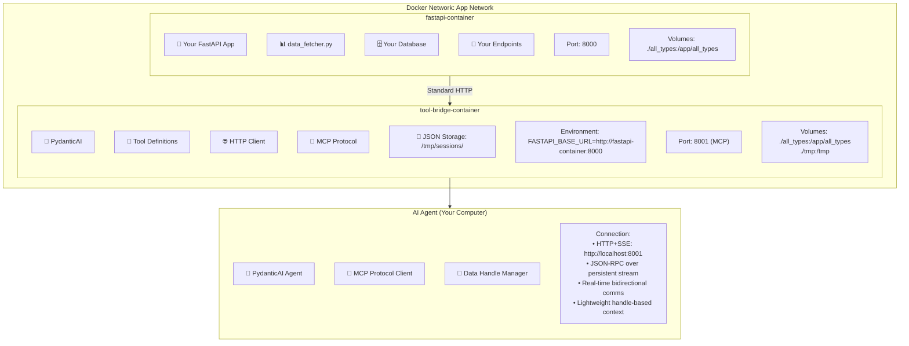

## 6. Docker Container Communication Architecture with Data Handles

```
┌─────────────────────────────────────────────────────────────────────────────┐
│                              Docker Network: app-network                    │
├─────────────────────────────────────────────────────────────────────────────┤
│                                                                             │
│  ┌─────────────────────────┐                ┌─────────────────────────┐     │
│  │    fastapi-container    │                │   tool-bridge-container │     │
│  │                         │                │                         │     │
│  │  🐍 Your FastAPI App    │                │  🤖 PydanticAI          │     │
│  │  📊 data_fetcher.py     │                │  🔧 Tool Definitions    │     │
│  │  🗄️  Your Database      │                │  🌐 HTTP Client         │     │
│  │  🔌 Your Endpoints      │                │  📡 MCP Protocol        │     │
│  │                         │                │  💾 JSON Storage:       │     │
│  │  Port: 8000            │◄──────────────┤  /tmp/sessions/         │     │
│  │                         │ Standard HTTP  │                         │     │
│  │  Volumes:               │                │  Environment:           │     │
│  │  ./all_types:/app/     │                │  FASTAPI_BASE_URL=      │     │
│  all_types             │                │  http://fastapi-        │     │
│  │                         │                │  container:8000         │     │
│  │                         │                │                         │     │
│  │                         │                │  Port: 8001 (MCP)      │     │
│  │                         │                │                         │     │
│  │                         │                │  Volumes:               │     │
│  │                         │                │  ./all_types:/app/     │     │
│  │                         │                │  all_types             │     │
│  │                         │                │  ./tmp:/tmp            │     │
│  │                         │                │                         │     │
│  └─────────────────────────┘                └─────────────────────────┘     │
│                                                         │                   │
└─────────────────────────────────────────────────────────┼───────────────────┘
                                                          │
                                    ┌─────────────────────▼───────────────────┐
                                    │            AI Agent                     │
                                    │         (Your Computer)                 │
                                    │                                         │
                                    │  🤖 PydanticAI Agent                   │
                                    │  📡 MCP Protocol Client                │
                                    │  🔗 Data Handle Manager                │
                                    │                                         │
                                    │  Connection:                            │
                                    │  • HTTP+SSE: http://localhost:8001     │
                                    │  • JSON-RPC over persistent stream     │
                                    │  • Real-time bidirectional comms       │
                                    │  • Lightweight handle-based context    │
                                    │                                         │
                                    └─────────────────────────────────────────┘

```

## Mermaid Version


